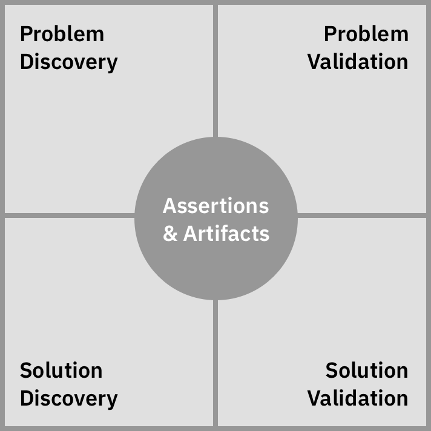

# The Four Contexts
*An integrated approach to design and implemention*

## What is it?

### States
There are two main states that we work with:
1. Current state, or “problems.” What is going on now that is causing pain and frustration or isn’t as good as it could be?
2. Future state, or “solutions.” What can we do to cause a change that addresses the problems and make things better?

### Activities
There are two main types of activities we engage in:
1. Discovery: exploring, widening, and understanding.
2. Validation: testing, narrowing, and deciding.

### Contexts
These states and activities combine into the *four contexts*. We are always doing one of the following:
1. Discovering the nature of problems.
2. Validating our understanding of problems.
3. Discovering possible solutions to a problem.
4. Validating our solution addresses a problem.

### Outputs
While working in these contexts, we are generating outputs:
- Assertions: what we think we know or what we think will happen if we do something.
- Artifacts: representations of our thinking about problems or attempts at solutions.

 

## How does it work?

### Concurrent
These contexts apply to whole team: client/domain expert, product, content, design, development, and others.

Members of the team may be working in different contexts at the same time.

### Non-linear
This is not a linear process. In general, we want to understand problems before proposing solutions, but this ignores the reality of existing knowledge, heuristics, and constraints.

There is a constant back-and-forth between discovery and validation of problems and solutions, all centered around assertions and artifacts.

We may take different paths through the contexts, depending on the needs and scope of the project.

At some point, the future state becomes the current state and solution validation transitions back into problem discovery anew, with the potential to repeat indefinitely.

### Multi-faceted
These general activities are not limited to a single context:
- learning
- observing
- interpreting
- making
- refining
- testing

Specific methods can be executed in different contexts. For example:
- *Prototyping* can be done during problem discovery, solution discovery, or solution validation.
- *Affinity mapping* can be done during problem validation or solution discovery.
- *Design studio* can be done during problem discovery or solution discovery.

For each method, we have to define how it can be used in different contexts.

## Confidence
Although the process is not linear, confidence generally increases in the following order:

- problem discovery (what is going on?)
- problem validation (are we addressing the right problem?)
- solution discovery (how might we address the problem?)
- solution validation (is our solution working?)

As we answer these questions, our confidence increases. If our confidence does increase, we move to a different context. For example, if a solution is not working, return to solution discovery to explore more options or to problem validation to confirm we're solving the right problem.

## Implications
We should be comfortable laying out a logical progression of activities, but acknowledge that we may move back and forth between different contexts as needed. The main thing is to be clear about what context we’re operating in at any given time.

…